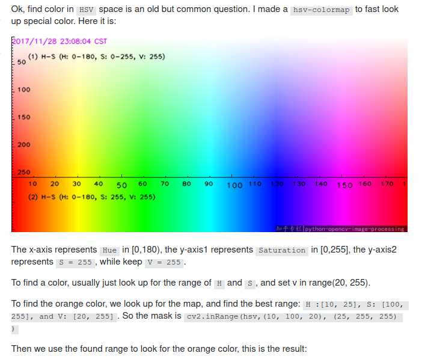

# Color Detection

## complate tutorial by __pyimagesearch__

- [color-detection](https://www.pyimagesearch.com/2014/08/04/opencv-python-color-detection/)


## hsv color picker
link for complate explanation and example for __opencv inRange__ lower and upper value

- [stackoverflow-answer](https://stackoverflow.com/questions/10948589/choosing-the-correct-upper-and-lower-hsv-boundaries-for-color-detection-withcv/48367205#48367205)



## test code

- image color detection

```
python color-detection.py -i test.jpg
```

- using webcam

```
python cam-color-detection
```
